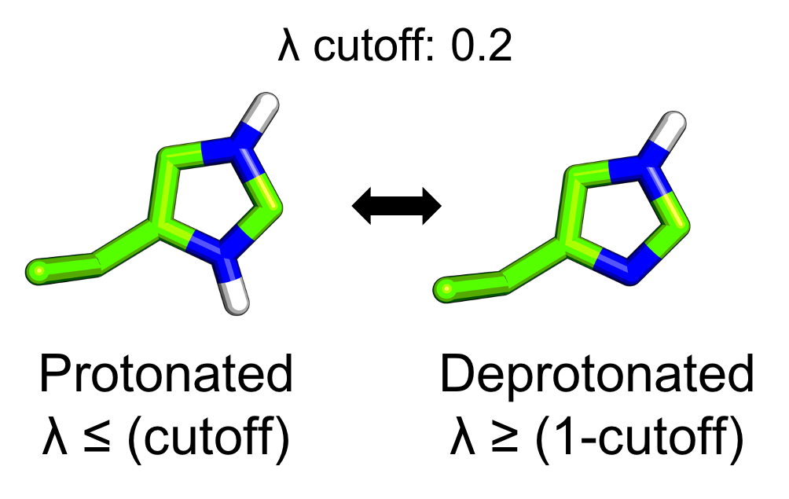
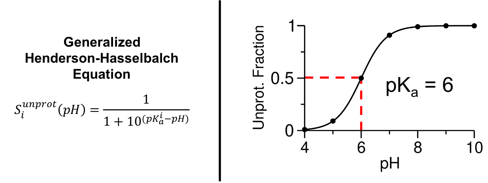

# Continuous Constant-pH Molecular Dynamics Analysis 

 

# Purpose

The purpose of the CpHMD-Analysis tool is to aid users in processing lambda and log files from Constant pH Molecular Dynamics (CpHMD) simulations run from the molecular dynamics software packages in [Amber](https://ambermd.org/) and [CHARMM](https://www.charmm.org/).
This python library is equiped to calculate the unprotonated fraction, pure and mixed states, running unprotonated fractions, and pKas of titratable residues from the lambda files produced by CpHMD simulations.
Additionally, functions have been added to the library to make plotting the running unprotonated fractions and titrations curves quick and easy. 
Since CpHMD is often used with a pH-based replica exchange protocol the library also can calculate exchange statics and plot replica walks. 

# What's Included? 

### 1 - cphmdanalysis.py 
This is the python library and composed of 4 classes and 2 functions
#### Included Classes
1.) class lambda_data

*This class allows you to load lambda files and calculate the unprotated fractions and compute the running of the unprotated fractions.*

2.) class plotting_lambda_data

*This class allows for plotting of the running unprotonated fractions over time and titration curves of titratable residues.*

3.) class log_analysis_charmm 

*This class allows for the loading, processing, and plotting of CHARMM (version >C40) formatted log files, resulting in replica exchange statistics and plotting the replica walk through pH space.*

4.) class log_analysis_amber

*Does the same thing as the "class log_analysis_charmm," but for Amber formatted log files.*

### 2 - CpHMD_Analysis_Example_AMBER.ipynb
This jupyter notebook is a step-by-step walk through of how to use load, process, and plot your lambda and log files. 
This juptyer notebook will make for a starting template for your CpHMD project.

### 3 - amber_example_data
The included jupyter notebook can be run on the amber_example_data, which is provide in two directories sample_1 and sample_2.
In the directory "sample_1" is a set of lambda files and a log file from an initial run of pH-based replica exchange of CpHMD using implicit solvent (solvent model: GBNeck2) and "sample_2" are the set of lambda files and a log file from the restart of the simulation. 
This simulation was conducted on a small test case protein BBL (PDBid: 1W4H). 

# Background

In CpHMD simulations each titratable site, *i*, is treated as a continuous titration coordinate λ*i*, which is bound between 0 and 1, to govern the progress of that titratable site's protonation/deprotonation.
In practice the λ-value does not always sample exactly either 0 or 1, so a cutoff of 0.2 is used to define whether a given titratable site is protonated or deprotonated.
The cutoff value described here is the default cutoff value for all calculations in the CpHMD-Analysis python library.

 

Using the λ-values with the stated cutoff from a simulation at a single pH we can calculate the unprotonated fraction for each titratable site, *S**i**unprot*.

 

Where *ρ**i**unprot* and *ρ**i**prot* are the probabilities that a given titratable site is either unprotonated or protonated, respectively.
Keep in mind that this calculation exludes λ-values in a mixed state, meaning the λ-value falls between 0.2 and 0.8.
Calculating the *S**i**unprot* as function time provides a good indication to the convergence of you titratable sites protonation states in a CpHMD simulation, and is shown in the jupyter notebook tutorial (CpHMD_Analysis_Example_AMBER.ipynb). 
By calculating the *S**i**unprot* at each simulated pH and fitting these points to the generalized Henderson-Hasselbalch equation the pKa can be calculated.
 

 

In the Henderson-Hasselbalch equation *n* is the Hill coefficient, which represents the slope of the transition region of the titration curve.
One detail that you might be wondering about is the handling of tautomeric state of the titratable residues such as Histidine, Aspartic Acid, and Glutamic Acid.
In these cases an additional coordinate, χ, is used. 
Like the λ-value, the χ-value also continuously moves between 0 and 1 representing one or the other tautomeric states and is defined with a cutoff of 0.2.
For greater detail on λ- and χ-values please read the following articles listed in the next section.

# Futher Reading

[Constant-pH Molecular Dynamics Using Continuous Titration Coordinates](https://onlinelibrary.wiley.com/doi/full/10.1002/prot.20128?casa_token=8B4Dwn15TYwAAAAA%3A6PqtPhvsXLT6fC8966mRPL9j5jvzBVIe_8usNcO1Nk5mX_U3mAmRKMbCxM-Zo8zavUoeVfqWgicGWjcc)

[Constant-pH Molecular Dynamics with Proton Tautomerism](https://www.sciencedirect.com/science/article/pii/S0006349505726667)

[Continuous Constant pH Molecular Dynamics in Explicit Solvent with pH-based Replica Exchange](https://pubs.acs.org/doi/abs/10.1021/ct200146j?casa_token=Z4fT4L4XlOQAAAAA:_vvgxj40IgV07Wb-ZlYTVr8GG4xL4dJcWFOiW9rzOWBA_i8rAn0wekn570l40LTH-HxGiPQ0L4_svDMH)

For a full range of articles on the development and usage of CpHMD please visit the [Shen Lab website](https://www.computchem.org/publications).
