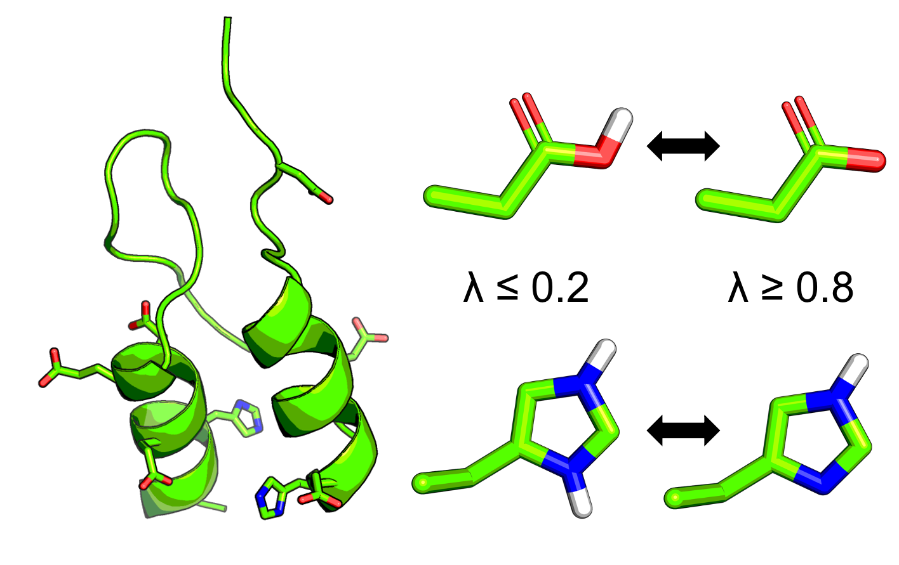

# CpHMD-Analysis 

 

# Purpose

The purpose of the CpHMD-Analysis tool is to aid users in processing lambda and log files from Constant pH Molecular Dynamics (CpHMD) simulations run from the molecular dynamics software packages in [Amber](https://ambermd.org/) and [CHARMM](https://www.charmm.org/).
This python library is equiped to calculate the unprotonated fraction, pure and mixed states, running unprotonated fractions, and pKas of titratable residues from the lambda files produced by CpHMD simulations.
Additionally, functions have been added to the library to make plotting the running unprotonated fractions and titrations curves quick and easy. 
Since CpHMD is often used with a pH-based replica exchange protocol the library also can calculate exchange statics and plot replica walks. 

# What's Included? 

### cphmdanalysis.py 
This is the python library and composed of 4 classes and 2 functions
#### Included Classes
1.) class lambda_data

*This class allows you to load lambda files and calculate the unprotated fractions and compute the running average of the unprotated fractions.*

2.) class plotting_lambda_data

*This class allows for plotting of the the running average of the unprotated fraction and titration curves of titratable residues.*

3.) class log_analysis_charmm 

*This class allows for the loading, processing, and plotting of CHARMM (version >C40) formatted log files, resulting in replica exchange statistics and plotting the replica walk through pH space.*

4.) class log_analysis_amber

*Does the same thing as the "class log_analysis_charmm," but for Amber formatted log files.*

### CpHMD_Analysis_Example_AMBER.ipynb
This jupyter notebook is a step-by-step walk through of how to use load, process, and plot your lambda and log files. 
This juptyer notebook will make for a starting template for your CpHMD project.

### amber_example_data
The included jupyter notebook can be run on the amber_example_data, which is provide in two directories sample_1 and sample_2.
In the directory "sample_1" is a set of lambda files and a log file from an initial run of pH-based replica exchange of CpHMD using implicit solvent (solvent model: GBNeck2) and "sample_2" are the set of lambda files and a log file from the restart of the simulation. 
This simulation was conducted on a small test case protein BBL (PDBid: 1W4H). 
